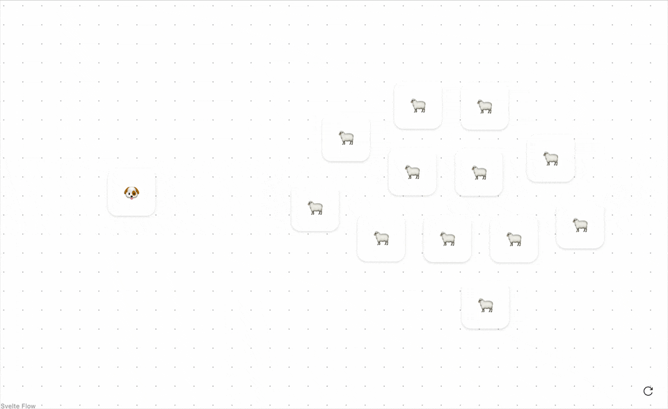

# Node Collision Algorithms

A playground to explore, develop, and benchmark algorithms that resolve overlapping nodes in the browser. Although the primary use cases are [React Flow](https://reactflow.dev/) & [Svelte Flow](https://svelteflow.dev/), the implementations aim to be use‑case agnostic.

> [!NOTE]
> Fiddle with the [demo](https://node-collision-algorithms.vercel.app/) or read our [blog post](https://xyflow.com/blog/node-collision-algorithms).



### Features

- **Playground** for comparing and developing algorithms & datasets using [SvelteKit](https://github.com/sveltejs/kit), [shadcn-svelte](https://github.com/huntabyte/shadcn-svelte) & [Svelte Flow](https://github.com/xyflow/xyflow)
- **WebAssembly Toolchain via Rust** to easily test out non-Javascript solutions using [wasm-bindgen](https://github.com/wasm-bindgen/wasm-bindgen) & [binaryen](https://github.com/WebAssembly/binaryen)
- **Benchmark** for comparing the performance on different datasets using [Vitest](https://github.com/vitest-dev/vitest) & [tinybench](https://github.com/tinylibs/tinybench)

### Algorithms

Each algorithm implements the same [`CollisionAlgorithm`](src/lib/algorithms/index.ts) interface (nodes in, nodes out) but uses different strategies for collision detection.

- **[Naive](src/lib/algorithms/naive.ts)**: Simple nested loop checking all node pairs - O(n²) complexity
- **[NaiveWasm](src/lib/algorithms/naiveWasm.ts)**: Same as the JS version, except [SoA instead of AoS](https://en.wikipedia.org/wiki/AoS_and_SoA)

#### Using different spatial index implementations

- **[Rbush](src/lib/algorithms/rbush.ts)**: R-tree based spatial index using [rbush](https://github.com/mourner/rbush) library with bulk insert mode
- **[RbushReplace](src/lib/algorithms/rbushReplace.ts)**: [rbush](https://github.com/mourner/rbush) library with updating single nodes
- **[Flatbush](src/lib/algorithms/flatbush.ts)**: Memory-efficient flat and static R-tree implementation using [flatbush](https://github.com/mourner/flatbush) (bulk insert)
- **[GeoIndex](src/lib/algorithms/geoIndex.ts)**: Rust based R-tree index with same data structure as flatbush using [geo-index](https://github.com/kylebarron/geo-index) (bulk insert)
- **[Quadtree](src/lib/algorithms/quadtree.ts)**: Recursive spatial partitioning into quadrants for fast lookups using [quadtree-ts](https://github.com/timohausmann/quadtree-js) (bulk insert)

## About this project

> ![WARNING]
> Although this project may appear complete, please consider it to be in an early stage and in need of feedback. If you find any inconsistencies or have any ideas on how to improve it, feel free to open an issue or file a pull request!

### Future Work

We are pleased with the current architecture and functionality of the playground and toolchain; nevertheless, numerous optimizations are yet to be explored and features to be expanded.

#### Optimizations

- [ ] Rebuild spatial indexes more sparsely
- [ ] Skip initial iteration by building required data structure in the main loop
- [ ] Investigate more performant use of libraries
- [ ] Investigate baseline overhead for calling WASM

#### Features

- [ ] Gather more realistic [datasets](src/lib/datasets.ts)
- [ ] Visualize and investigate reasons for differences in results
  - Possible causes: querying of stale indexes, stale values within single iterations, bug or incorrect use of library
- [ ] Compare different overlap resolution strategies
  - Lock position of dropped node
  - Support subflows and child nodes

#### Benchmark

- [ ] Measure memory usage
- [ ] Run benchmark automatically in isolated environment
- [ ] Investigate influence of GC settings
- [ ] Compare JS runtimes

## Benchmark Results

> [!IMPORTANT]  
> Every benchmark is incomplete and flawed. Always expect mistakes, either in the implementation, the test environment, or in the method of measurement.

TBD

## Setup

### Prerequisites

1. **Rust/Rustup** (required to build WebAssembly algorithms)

```bash
curl --proto '=https' --tlsv1.2 -sSf https://sh.rustup.rs | sh
```

2. **Binaryen** (required for WASM optimization)

```bash
# macOS
brew install binaryen

# Debian/Ubuntu
sudo apt install binaryen

# Arch Linux
sudo pacman -S binaryen
```

3. **Node.js** (v22 or higher)

4. **pnpm**

```bash
npm install -g pnpm
```

### Installation

1. Clone the repository:

```bash
git clone https://github.com/xyflow/node-collision-algorithms.git
cd node-collision-algorithms
```

2. Install dependencies:

```bash
pnpm install
```

3. Build WebAssembly modules:

```bash
pnpm run build:wasm
```

4. Start the development server:

```bash
pnpm run dev
```

The application will be available at `http://localhost:5173`

## Development

TBD
