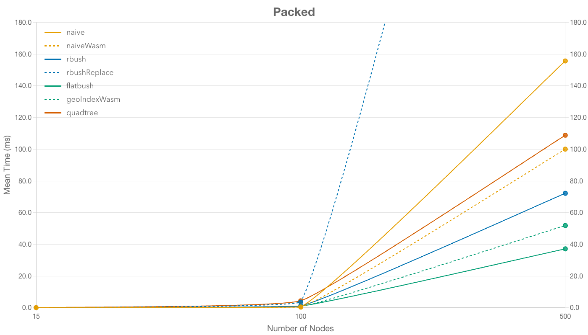
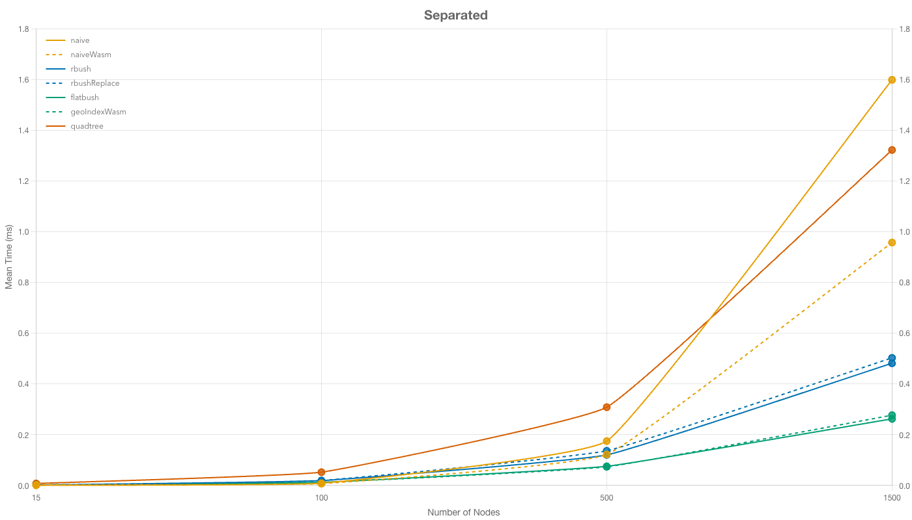
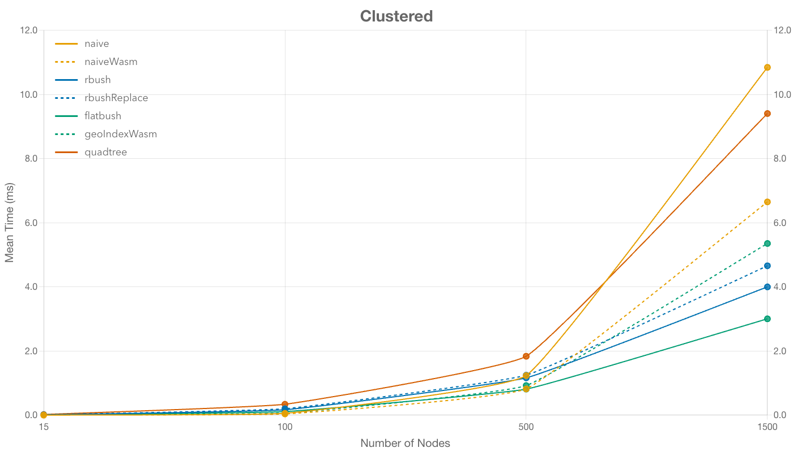

# Node Collision Algorithms

A playground to explore, develop, and benchmark algorithms that resolve overlapping nodes in the browser. Although the primary use cases are [React Flow](https://reactflow.dev/) & [Svelte Flow](https://svelteflow.dev/), the implementations aim to be use‑case agnostic.

> [!NOTE]
> _Fiddle with the [demo](https://node-collision-algorithms.vercel.app/) or read our [blog post](https://xyflow.com/blog/node-collision-detection-algorithms)._

### Features

- **Playground** for comparing and developing algorithms & datasets using [SvelteKit](https://github.com/sveltejs/kit), [shadcn-svelte](https://github.com/huntabyte/shadcn-svelte) & [Svelte Flow](https://github.com/xyflow/xyflow)
- **WebAssembly Toolchain via Rust** to easily test out non-Javascript solutions using [wasm-bindgen](https://github.com/wasm-bindgen/wasm-bindgen) & [binaryen](https://github.com/WebAssembly/binaryen)
- **Benchmark** for comparing the performance on different datasets using [Vitest](https://github.com/vitest-dev/vitest) & [tinybench](https://github.com/tinylibs/tinybench)


### Algorithms

Each algorithm implements the same [`CollisionAlgorithm`](src/lib/algorithms/index.ts) interface (nodes in, nodes out) but uses different strategies for collision detection.

- **[Naive](src/lib/algorithms/naive.ts)**: Simple nested loop checking all node pairs - O(n²) complexity
- **[NaiveWasm](src/lib/algorithms/naiveWasm.ts)**: Same as the JS version, except [SoA instead of AoS](https://en.wikipedia.org/wiki/AoS_and_SoA)

#### Using different spatial index implementations

- **[Rbush](src/lib/algorithms/rbush.ts)**: R-tree based spatial index using [rbush](https://github.com/mourner/rbush) library with bulk insert mode
- **[RbushReplace](src/lib/algorithms/rbushReplace.ts)**: [rbush](https://github.com/mourner/rbush) library with updating single nodes
- **[Flatbush](src/lib/algorithms/flatbush.ts)**: Memory-efficient flat and static R-tree implementation using [flatbush](https://github.com/mourner/flatbush) (bulk insert)
- **[GeoIndex](src/lib/algorithms/geoIndex.ts)**: Rust based R-tree index with same data structure as flatbush using [geo-index](https://github.com/kylebarron/geo-index) (bulk insert)
- **[Quadtree](src/lib/algorithms/quadtree.ts)**: Recursive spatial partitioning into quadrants for fast lookups using [quadtree-ts](https://github.com/timohausmann/quadtree-js) (bulk insert)

## Benchmark Results

> [!IMPORTANT]  
> _Every benchmark is incomplete and flawed. Always expect mistakes, either in the implementation, the test environment, or in the method of measurement._

There are outstanding optimizations to be done to better leverage spatial indexes and further reduce overhead. Check out the [issues tab](https://github.com/xyflow/node-collision-algorithms/issues) if you are interested.

### Packed

Nodes are positioned in a dense grid with maximum overlap. This scenario stresses algorithms with many collision pairs.



### Separated

Nodes are spaced apart with no overlaps. This tests the best-case scenario where algorithms can early-exit without collision resolution.



### Clustered

Nodes form several clusters with overlaps within each cluster. This represents a realistic use case with localized collision groups.



## Running the project

### Prerequisites

1. **Rust/Rustup** (required to build WebAssembly algorithms)

```bash
curl --proto '=https' --tlsv1.2 -sSf https://sh.rustup.rs | sh
```

2. **Binaryen** (required for WASM optimization)

```bash
# macOS
brew install binaryen

# Debian/Ubuntu
sudo apt install binaryen

# Arch Linux
sudo pacman -S binaryen
```

3. **Node.js** (v22 or higher)

4. **pnpm**

```bash
npm install -g pnpm
```

### Installation

1. Clone the repository:

```bash
git clone https://github.com/xyflow/node-collision-algorithms.git
cd node-collision-algorithms
```

2. Install dependencies:

```bash
pnpm install
```

3. Build WebAssembly modules:

```bash
pnpm run build:wasm
```

4. Start the development server:

```bash
pnpm run dev
```

The application will be available at `http://localhost:5173`
